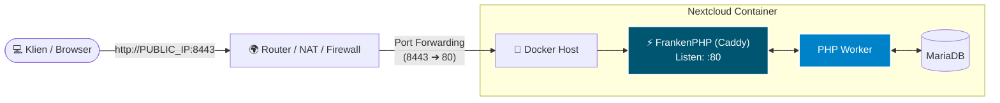
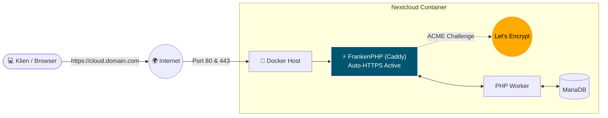
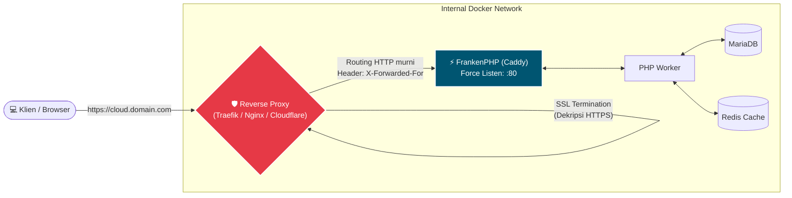

# Nextcloud High-Performance Stack (FrankenPHP + Alpine Linux)

An enterprise-ready, ultra-lightweight, and modern Nextcloud deployment wrapper. This stack utilizes **FrankenPHP** (a high-performance PHP application server built on top of the Caddy web server) compiled on **Alpine Linux** to ensure extremely low memory footprint, HTTP/3 support natively, and worker-mode performance.

This repository features an intelligent `entrypoint.sh` startup script that automatically provisions Nextcloud, generates Caddy configurations on-the-fly, enforces rigid security policies, and wires up companion microservices (Redis, ONLYOFFICE, Notify Push, and Elasticsearch).

---

## 🚀 Key Features

* **FrankenPHP Application Server:** Eliminates the overhead of separate Nginx and PHP-FPM processes by bundling web serving and PHP execution into a single Go-backed binary.
* **Alpine Linux Substrate:** Minimal attack surface and lightning-fast container boots.
* **Intelligent Auto-Configuration:** Automatically synchronizes Nextcloud's `config.php` database states with given environment parameters (Trusted Domains, Trusted Proxies, Overwrite Protocols).
* **Atomic Security Hardening:** Enforces Strict-Transport-Security (HSTS), blocks access to sensitive framework folders (`/build`, `/config`, `.ht*`), and pre-caches static assets.
* **Zero-Sed Database Integration:** Configures apps via native Nextcloud `occ` commands instead of fragile runtime configuration regex parsing.

---

## 🛠️ Environment Variables Config Matrix

Control the entire stack lifecycle by tweaking these environment variables in your deployment files:

| Variable | Default | Description |
| :--- | :--- | :--- |
| `NC_DOMAIN` | `:80` | Target domain or port syntax (e.g., `cloud.example.com` or `:80`). |
| `REVERSE_PROXY` | `no` | Toggle `yes` if deploying behind external proxies (Traefik, Nginx, Cloudflare Tunnel). |
| `FORWARD_PORT` | *None* | External port if your network maps non-standard public ports (e.g., `8443`). |
| `NC_HOST` | *Required* | Internal service name of the Nextcloud container used for companion calls. |
| `ONLYOFFICE_HOST` | *Optional* | Container/Host address for ONLYOFFICE Document Server integration. |
| `NOTIFY_PUSH_HOST`| *Optional* | Container/Host address running Nextcloud's high-performance websocket client. |
| `ELASTICSEARCH_HOST`|*Optional* | Full URL/Host of an Elasticsearch node to initialize Full-Text Search. |
| `REDIS_HOST` | *Optional* | Hostname of a Redis database to activate distributed caching and transactional locking. |
| `REDIS_PASSWORD` | *Optional* | Authentication password for the connected Redis node. |

---

## 📋 Deployment Scenarios Setup Guide

Choose the deployment architecture block that exactly matches your underlying hosting infrastructure:

### Scenario 1: IP with Custom Port Forwarding (Local / Home Lab)
Best suited for local network testing, home labs, or environments behind NAT routers forwarding a custom external port to the server.


* **Behavior:** The script uses your server's public/local IPv4 seamlessly, configures Nextcloud to allow access through the forwarded custom port, and retains standard HTTP communication internally while keeping link rendering properly configured.
* **Configuration Snippet** (`.env` or `docker-compose.yml`)

```yaml
environment:
  - NC_DOMAIN=:80
  - REVERSE_PROXY=no
  - FORWARD_PORT=8443 # Sent to router's external facing port
  - PHONE_REGION=ID
```

### Scenario 2: Standalone Domain (Direct Public HTTPS via Caddy)

Ideal for servers directly exposed to the internet with ports 80 and 443 fully open. Caddy inside FrankenPHP will automatically obtain and renew TLS certificates via Let's Encrypt / ZeroSSL.



* **Behavior:** Activates automatic HTTPS. Caddy serves production traffic natively over HTTP/2 and HTTP/3.

* **Configuration Snippet** (.env or docker-compose.yml):

```YAML
    environment:
  - NC_DOMAIN=cloud.yourdomain.com
  - REVERSE_PROXY=no
  - PHONE_REGION=ID
```
Scenario 3: Domain Behind an External Reverse Proxy (Traefik, NPM, Cloudflare)

Standard production enterprise deployment where an edge load balancer or central reverse proxy handles SSL termination and directs traffic downstream to this container.



* **Behavior:** Forces Caddy to listen strictly on port 80 to prevent ACME conflicts. Injects trusted_proxies configuration block automatically tracking the container gateway network (172.16.0.0/12 equivalents) along with your WAN IPv4/IPv6 addresses. Enforces Nextcloud to generate all system links explicitly over https.

* **Configuration Snippet** (.env or docker-compose.yml):

```YAML
environment:
  - NC_DOMAIN=cloud.yourdomain.com
  - REVERSE_PROXY=yes
  - NC_HOST=nextcloud_app # Internal service name
  - PHONE_REGION=ID
```
## 📦 Production Architecture Template (docker-compose.yml)

The complete production-ready stack file combining Scenario 3 (Reverse Proxy mode) along with all high-performance modules:
```YAML

version: '3.8'

services:
  nextcloud_app:
    build: .
    container_name: nextcloud_frankenphp
    restart: always
    networks:
      - proxy_network
      - backend_network
    volumes:
      - nextcloud_html:/var/www/html
      - nextcloud_config:/config
      - nextcloud_data:/data
    environment:
      - NC_DOMAIN=cloud.yourdomain.com
      - REVERSE_PROXY=yes
      - FORWARD_PORT=443
      - NC_HOST=nextcloud_app
      - ONLYOFFICE_HOST=onlyoffice_ds
      - NOTIFY_PUSH_HOST=notify_push
      - REDIS_HOST=redis_cache
      - REDIS_PASSWORD=YourSecureStrongRedisPassword
      - ELASTICSEARCH_HOST=elasticsearch_fts:9200
      - PHONE_REGION=ID
      - SERVER_ID=nc_enterprise_prod_01
    depends_on:
      - mariadb_db
      - redis_cache

  mariadb_db:
    image: mariadb:10.11
    container_name: nextcloud_mariadb
    restart: always
    networks:
      - backend_network
    volumes:
      - mariadb_data:/var/lib/mysql
    environment:
      - MYSQL_ROOT_PASSWORD=YourSecureRootDBPassword
      - MYSQL_DATABASE=nextcloud
      - MYSQL_USER=nextcloud
      - MYSQL_PASSWORD=YourNextcloudDBPassword

  redis_cache:
    image: redis:7-alpine
    container_name: nextcloud_redis
    restart: always
    command: redis-server --requirepass YourSecureStrongRedisPassword
    networks:
      - backend_network
    volumes:
      - redis_data:/data

  notify_push:
    image: nextcloud:frankenphp-alpine # Adjust if using companion sidecar image
    container_name: nextcloud_push
    restart: always
    networks:
      - backend_network
    environment:
      - NEXTCLOUD_URL=[https://cloud.yourdomain.com](https://cloud.yourdomain.com)
    depends_on:
      - nextcloud_app

  onlyoffice_ds:
    image: onlyoffice/documentserver:latest
    container_name: onlyoffice_docserver
    restart: always
    networks:
      - backend_network
    environment:
      - JWT_ENABLED=true
      - JWT_SECRET=YourSecureJWTSecretToken
    volumes:
      - onlyoffice_data:/var/www/onlyoffice/Data
      - onlyoffice_logs:/var/log/onlyoffice

  elasticsearch_fts:
    image: elasticsearch:7.17.10
    container_name: nextcloud_elasticsearch
    restart: always
    networks:
      - backend_network
    environment:
      - discovery.type=single-node
      - "ES_JAVA_OPTS=-Xms512m -Xmx512m"
    volumes:
      - es_data:/usr/share/elasticsearch/data

volumes:
  nextcloud_html:
  nextcloud_config:
  nextcloud_data:
  mariadb_data:
  redis_data:
  onlyoffice_data:
  onlyoffice_logs:
  es_data:

networks:
  proxy_network:
    external: true # Shared network containing your edge Traefik/Nginx Proxy Manager
  backend_network:
    internal: true
```
### 🔒 Automated Hardening & Asset Optimization

* Upon container boot, the architecture instantly optimizes and locks down the environment:

* Strict File Permissions: Re-owns web roots dynamically to www-data:www-data.

* Mimetype Migrations: Automatically executes costly high-performance mimetype migrations (maintenance:repair --include-expensive).

* Background Window Definition: Locks maintenance windows precisely to off-peak periods (maintenance_window_start = 1 -> 01:00 AM server time).

* Reverse Proxy Trust Chains: Automatically reads container networking gateway maps alongside current public interface routing data via icanhazip.com to prevent header spoofing and intermediate routing blocks.

### 🛠️ Post-Deployment Verification

* Once your preferred setup scenario finishes initializing, run the following health checks:

```sh
#Verify Caddyfile structure inside the operational container
docker exec -it nextcloud_frankenphp caddy fmt /etc/caddy/Caddyfile
#Confirm Nextcloud status configuration parameters
docker exec -it --user www-data nextcloud_frankenphp php occ config:system:get trusted_domains
docker exec -it --user www-data nextcloud_frankenphp php occ config:system:get trusted_proxies
#Run Full-Text Search indexing sync for Elasticsearch
docker exec -it --user www-data nextcloud_frankenphp php occ fulltextsearch:index
```

## Contributing

If you find these images useful, consider donating via PayPal or opening an issue on GitHub.

Your support helps maintain and improve these images for the community.

## License

This project is licensed under the terms of the GNU General Public License v3.0.

Please respect the intellectual efforts involved in creating these images. If you intend to copy or use ideas from this project, proper credit is appreciated.

From Indonesia with love.

## License
